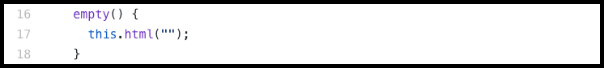
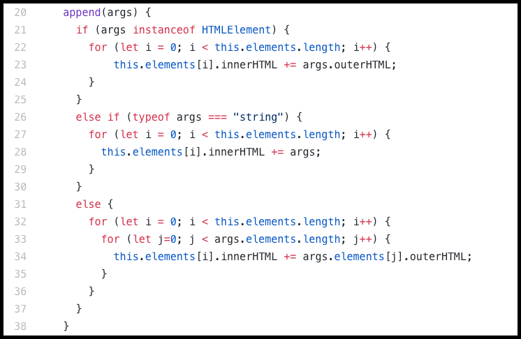

# Aquery

Before testing the library, please try to read the following readme in it's entirety.

**_If you find a bug or have a recommendation to make this application better, please contact me through GitHub or my email, arittrosaha@gmail.com. Thank you very much!_**

---
## Summary
**Synopsis** - JavaScript DOM Manipulation Library inspired by jQuery.

**Stack** - Vanilla JS

---
## How to use it?
**Step 1** - Clone or download the project using the terminal
* Using the terminal - $ git clone https://github.com/arittrosaha/Aquery
* Using the Git GUI - Use the green "Clone or download" button to download.

**Step 2** - Copy the file Aquery/lib/Aquery_lite.js to your project.

**Step 3** - Import $l function Aquery_lite.js and save it into a variable for further usecases.
* ES5 - var $l = require('.Aquery_lite.js');
* ES6 - import $l from '.Aquery_lite.js';

---
## Current Features

### $l(arg)
* jQuery equivalence - $() or jQuery selector.
* Vanilla JS DOM functions used - document.addEventListener('DOMContentLoaded', callback), document.querySelectorAll(arg)
* Code breakdown:
  * arg can be a string or an HTMLElement or a function:
    * If arg is a string, it is expected to be a CSS selector that I use to identify nodes in the page using vanilla JS.
    * If arg is a function, I take it as a callback that needs to be executed when the document is ready.
    * If arg is already an instance of HTMLElement, then my library will work it as well. 
  * If arg is a string or an HTMLElement, a new DomNodeCollection is returned.\

---
### $l.extend(object1, object2, object3,...)
* jQuery equivalence - $.extend()
* Code breakdown:
  * The method is expecting two or more objects as arguments.
  * It merges all the passed objects by extending the first object with the key-value pairs from all the remaining objects.
  

---
### $l.ajax()
* jQuery equivalence - $.ajax()
* Vanilla JS DOM functions used - XMLHttpRequest()
* Code breakdown:
  * It can receive one options object argument, optionally.
  * It has a defaults object for success, error, url, method, data, and contentType. The defaults object gets merged with options object using our extend function.
  * Using the options supplied by the user, the request is made using vanilla JavaScript. 
  * The proper response is delivered to the success/error callback. This response is made sure to be an object and not a string by using JSON.stringify.

---
### DOMNodeCollection
* jQuery equivalence - The jQuery object known as the "wrapped set," an array-like indexible structure that contains all the selected DOM elements.
* Code breakdown:
  * It's a Class that receives an array of HTMLElements as its only argument which is stored as an instance variable.
  * All the instant methods of this class gets applied to every node in the internal array.
  * The core function should return an instance of DOMNodeCollection.
  

---
### DOMNodeCollection.prototype methods
#### html(str)
* jQuery equivalence - $().html()
* Vanilla JS DOM functions used - HTMLElement.innerHTML
* Code breakdown:
  * It can optionally receive a string as a parameter.
  * If it receives an argument, this will become the innerHTML of the each of the nodes. 
  * If it does not receive an argument, it returns the innerHTML of the first node in the array.
  

---
#### empty()
* jQuery equivalence - $().empty()
* Code breakdown:
  * This method clears out the content of all nodes in the internal array by setting the html of all nodes to an empty string.

---
#### append(args)
* jQuery equivalence - $().append()
* Vanilla JS DOM functions used - HTMLElement.innerHTML, HTMLElement.outerHTML
* Code breakdown:
  * This method accepts a jQuery-lite wrapped collection, an HTML element, or a string. 
  * It appends the outerHTML of each element in the argument to the innerHTML of each element in the DOMNodeCollection. 
  * The method does not convert strings into HTML elements; it just passes them straight through to the elements' innerHTML.
  

---
#### remove()
* jQuery equivalence - $().remove()
* Vanilla JS DOM functions used - HTMLElement.outerHTML
* Code breakdown:
  * The method does not expect any argument.
  * It removes the html of all the nodes in the array from the DOM.
  * It also remove all nodes from the internal array.
  

---
#### attr(reader, setter)
* jQuery equivalence - $().attr()
* Vanilla JS DOM functions used - HTMLElement.getAttribute(reader), HTMLElement.setAttribute(reader, setter)
* Code breakdown:
  * The method accepts a reader (an attribute whose value is being looked for) and an optional setter (the new value for the given attribute).
  * If the method receives only a reader, it will return the value of that attribute of the first HTMLElement of a DomNodeCollection.
  * If it receives a reader and a setter, it will set the new value (the passed setter) to the specified attribute (the reader) of all nodes in the internal array.
  * If the attribute is not present on a node, nothing will set or read and it won't return anything.
  

 
--- 
#### addClass(arg)
* jQuery equivalence - $().addClass()
* Vanilla JS DOM functions used - HTMLElement.getAttribute(reader), HTMLElement.setAttribute(reader, setter)
* Code breakdown:
  * The method expects a string as an argument. 
  * The string gets set as the value of class attribute of all nodes in the internal array.
    * If a node lacks a class attribute, a new class attribute is first created and then set with the value given (arg).
    * If a node already has a class attribute with a value, the new argument gets concatenated with the old value by a string of space.

---
#### removeClass(arg)
* jQuery equivalence - $().removeClass()
* Vanilla JS DOM functions used - HTMLElement.getAttribute(reader), HTMLElement.setAttribute(reader, setter)
* Code breakdown:
  * The method expects a string as an argument. 
  * The value passed in gets removed from all nodes in the internal array.
  * If a node has multiple value, separated by space, for its class attribute, still only the specific one that matches the given arguments gets removed.
  

---  
#### Traversal methods:
##### children()
* jQuery equivalence - $().children()
* Vanilla JS DOM functions used - HTMLElement.children
* Code breakdown:
  * The method does not expect any argument.
  * It returns a DOMNodeCollection of all children of all nodes in the internal array.
  

---
##### parent()
* jQuery equivalence - $().parent()
* Vanilla JS DOM functions used - HTMLElement.parentElement
* Code breakdown:
  * The method does not expect any argument.
  * It returns a DOMNodeCollection of the parents of each of the nodes.
  

---
##### find(arg)
* jQuery equivalence - $().find()
* Vanilla JS DOM functions used - HTMLElement.querySelectorAll(arg)
* Code breakdown:
  * The method expect a string argument.
  * It returns a DOMNodeCollection of all the nodes matching the selector passed in as an argument that are descendants of the nodes.
  

---
#### Event Handling methods:
##### on(event, callback)
* jQuery equivalence - $().on()
* Vanilla JS DOM functions used - HTMLElement.addEventListener(event, callback)
* Code breakdown:
  * The method expects two argument.
    * First argument needs to be the name of the event in string format.
    * Second argument needs to be a callback which gets executed once the corresponding event is triggered.
  * It adds the event handler to all the nodes in the internal array.
  * It also creates a callback attribute for all the nodes that saves the callback because it will be required when or if the event handler is removed.
  

---
##### off(event, callback)
* jQuery equivalence - $().off()
* Vanilla JS DOM functions used - HTMLElement.removeEventListener(event, callback)
* Code breakdown:
  * The method expects no argument.
  * It removes the event handler from all the nodes in the internal array by using the callback that saved as an attribute of the respective nodes when the event handler was first installed.
  

---
## Future additions
#### Promise - Have my ajax function return a promise.
#### Build a simple app (i.e. a tic-tac-toe game) using this custom library.
